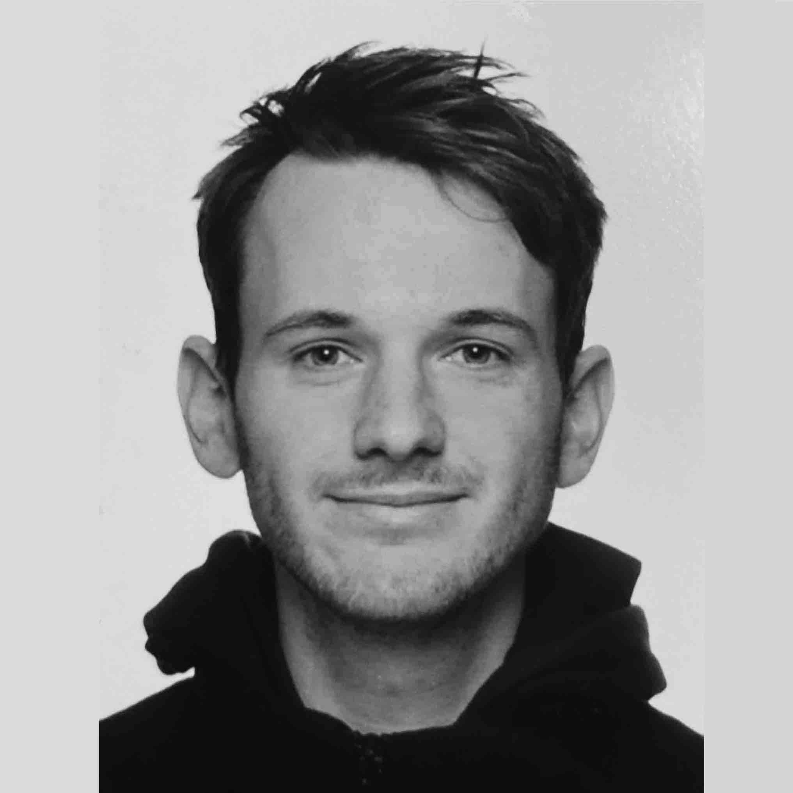

## About Me 

I am a first-year PhD student in computational statistics applied to renewable energy, at Imperial College London, under supervision of Axel Gandy (lead supervisor) and David Brayshaw. Due to finish end of 2021. I am Funded the EPSRC Centre for Doctoral Training in Mathematics for Planet Earth. I write general audience articles about renewable energy.

Dutch native having lived in Amsterdam (1993-1996, 2010-2012, 2016-2017), Washington DC (1996-2010), Oxford (2012-2016) and London (2017-present).

###  Research Interests

Computational statistics, renewable energy, machine/deep learning. See [research](research) for a description of PhD topic, full list of publications, and other research activities.

### Educational History

Year | Institution | Description
----- | ------- | ------------------
2018 | Imperial College London | Master's degree by research, Mathematics
2016 | University of Oxford | Master's degree, Mathematical & Theoretical Physics
2015 | University of Oxford | Bachelor's degree, Mathematics
2012 | International School of Amsterdam | International Baccalaureate

### Acknowledgements

Page design based on template by [Ankit Sultana](https://github.com/ankitsultana).

---
