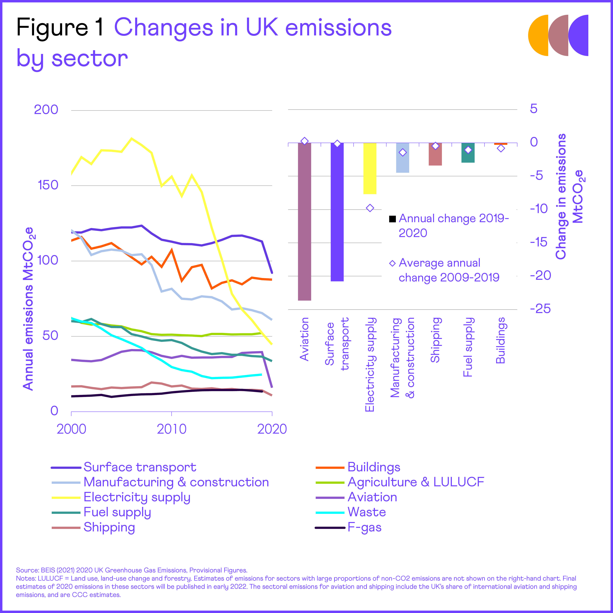
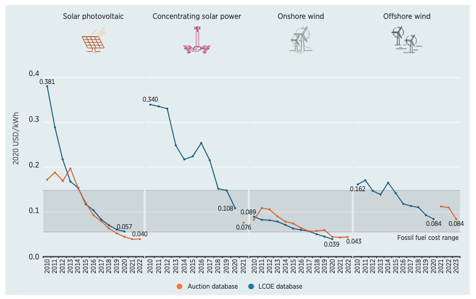
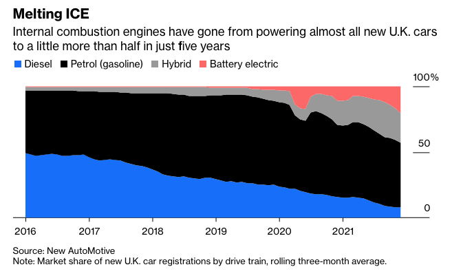
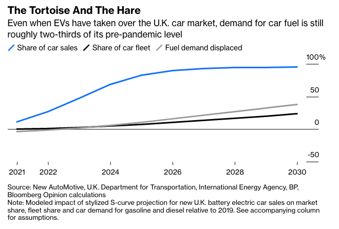
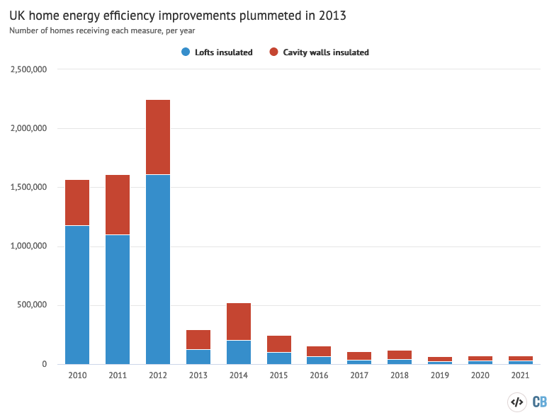
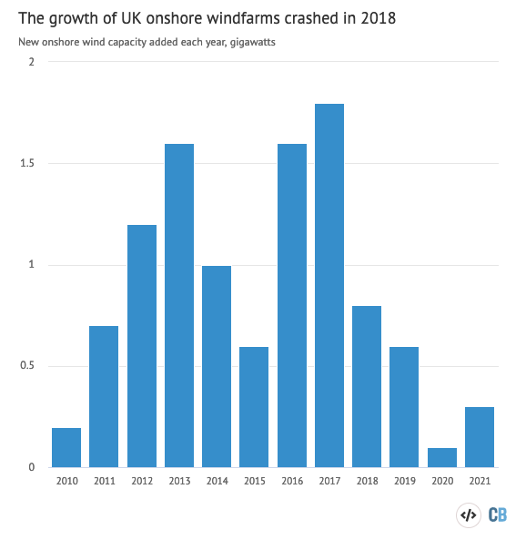

## *Perspectives from 5 years in energy*

*Originally published 2022*

---

## The situation

---

*UK carbon emissions per sector. Source: [Climate Change Committee](https://www.theccc.org.uk/publication/2021-progress-report-to-parliament/)*

---

## The good

---

#### Enormous renewable price decreases

*Cost of renewable electricity generation over time. Source: [IRENA](https://www.irena.org/-/media/Files/IRENA/Agency/Publication/2021/Jun/IRENA_Power_Generation_Costs_2020.pdf?la=en&hash=755CB6E57667D53B629967EC7F9BE57A55D1CD78)*
&nbsp;

*Cost of renewable electricity generation over time. Source: [Our World in Data](https://ourworldindata.org/cheap-renewables-growth)*
&nbsp;
[Our World in Data Article](https://ourworldindata.org/cheap-renewables-growth)
&nbsp;
[Subsidy free offshore wind](https://www.nature.com/articles/s41560-020-0661-2)

---

#### Enormous decreases in lithium ion costs

*Cost of lithium ion battery packs over time. Source: [Bloomberg](https://about.bnef.com/blog/battery-pack-prices-cited-below-100-kwh-for-the-first-time-in-2020-while-market-average-sits-at-137-kwh/)*
&nbsp;

*Cost of renewable electricity generation over time. Source: [Our World in Data](https://ourworldindata.org/cheap-renewables-growth)*

---

#### Electric cars becoming mainstream

Great article on this: [link](https://www.carbonbrief.org/factcheck-how-electric-vehicles-help-to-tackle-climate-change)

*Cost of renewable electricity generation over time. Source: Liam Denning, [Bloomberg](https://www.bloomberg.com/opinion/articles/2022-03-01/switch-to-clean-energy-may-mean-subsidizing-the-dirty-kind?sref=JMv1OWqN)*

*Cost of renewable electricity generation over time. Source: Liam Denning, [Bloomberg](https://www.bloomberg.com/opinion/articles/2022-03-01/switch-to-clean-energy-may-mean-subsidizing-the-dirty-kind?sref=JMv1OWqN)*

---

#### CFD payments in UK made offshore wind mainstream
[CFD article](http://energyjournal.co.uk/Edition_9#9_A3)

---

## The bad

---

#### Home insulation very slow

*UK home insulation. Source: [Carbon Brief, Climate Change Committee](https://www.carbonbrief.org/analysis-cutting-the-green-crap-has-added-2-5bn-to-uk-energy-bills)*

---

#### Onshore wind died

*UK home insulation. Source: [Carbon Brief, BEIS](https://www.carbonbrief.org/analysis-cutting-the-green-crap-has-added-2-5bn-to-uk-energy-bills)*

[Carbon Brief Article](https://www.carbonbrief.org/analysis-cutting-the-green-crap-has-added-2-5bn-to-uk-energy-bills)

---

## Fossil fuel phaseout has to happen on the demand side

- [Great article on this point by Dieter Helm](https://www.ft.com/content/13702f42-a923-4cd8-a6c7-03f775a0742b)
- [Guardian claim: 100 companies responsible for 71% of global emissions](https://www.theguardian.com/sustainable-business/2017/jul/10/100-fossil-fuel-companies-investors-responsible-71-global-emissions-cdp-study-climate-change)

---

## Energy storage: the holy grail

| Energy source | kwH / kg | kWh / l |
| ------------- | -------- | ------- |
| Gasoline      | 13       | 9.5     |
| Lignite coal  | 4        | -       |
| Natural gas   | 15       | 10      |
| Water, 100m   | 0.0003   | 0.0003  |
| 1kg, 100m     | 0.0003   | -       |
| Lithium ion   | 0.1      | 0.5     |
| Hydrogen FC   | 30       | 1       |
