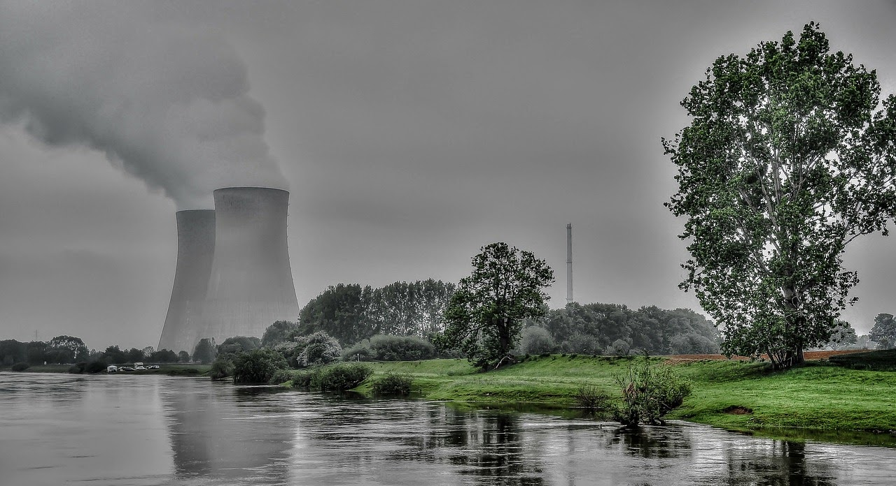
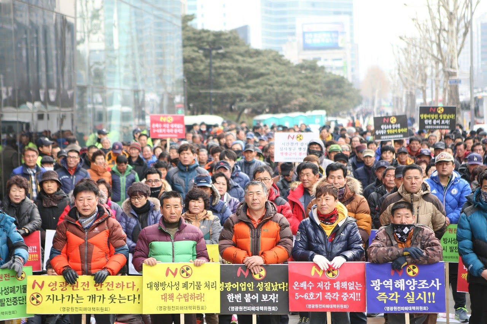
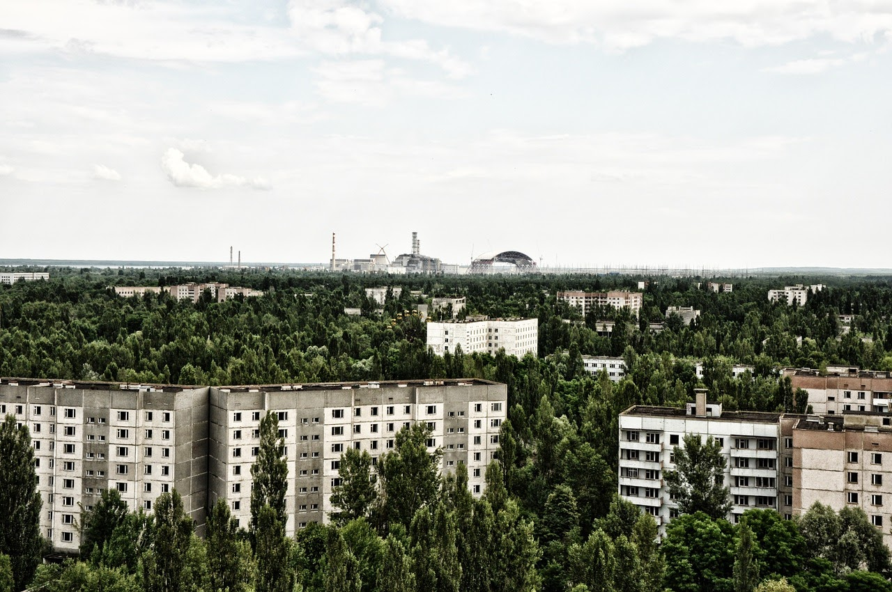
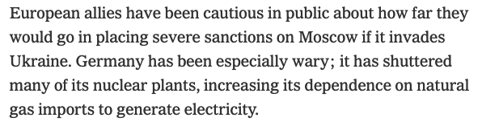
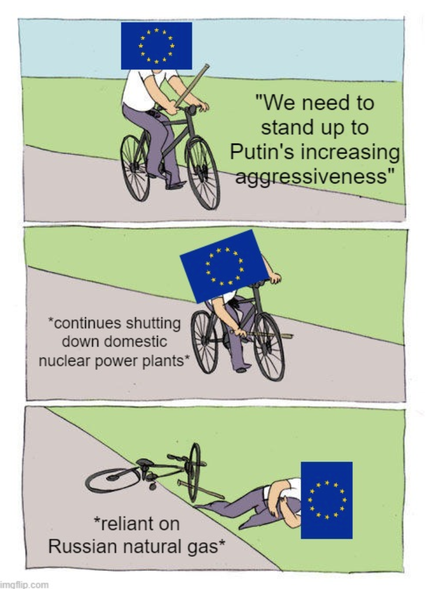
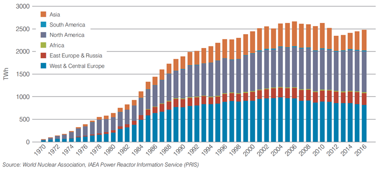
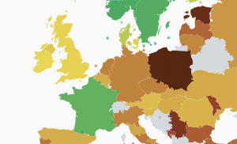

## *What's the deal with nuclear?*

*Original published 2019, updated 2022*

---

*Nuclear power: for some, it's **the** solution to climate change, others want it gone tomorrow. What's the deal? Source: Burghard*

---

As the world strives to reduce its carbon emissions, massive efforts are being taken to decarbonise electricity. In most developed countries, fossil fuels like coal are on the way out, being gradually (albeit slowly) replaced by weather-dependent renewables such as solar and wind.

However, keeping the lights on while generating most electricity from renewables comes with significant challenges (see a [previous article](why_renewables_are_difficult.md) that discusses this in more detail). The key difficulty comes from the fact that electricity supply and demand must always match perfectly. Traditionally, this involved adjusting power plant output to meet demand, including rapid spikes or dips. In fact, grid operators [tune in](https://www.youtube.com/watch?v=UTM2Ck6XWHg) to popular TV shows to ensure supply is increased exactly as thousands of people turn on their kettle at the end of an episode.

---

*A famous graph showing total UK electricity demand during the 1990 World Cup Semi-Final against Germany, with spikes at times when watchers massively turned on their kettles. Source: National Grid*

---

Weather-dependent renewables make this balancing act more difficult, since generation levels are controlled by e.g. the wind or sun and cannot be adjusted. In fact, the supply-demand balance problem means that, in countries without the possibility of hydropower (requiring mountainous and rainy terrain), it is virtually impossible to go 100% renewable without drastically increasing electricity prices. This is sometimes referred to as the [*energy trilemma*](https://www.carbonbrief.org/climate-rhetoric-whats-an-energy-trilemma): in most regions, only two of supply security, affordable energy and environmental sustainability can be satisfied. Two of the most promising solutions, grid-scale storage (storing excess renewable production at times of high supply and using it when supply is low) and carbon capture-and-storage (storing carbon emissions from fossil fuel generation without releasing them into the atmosphere), are unproven and not yet economically viable. For this reason, most countries still generate most of their electricity from fossil fuels — it’s too difficult or expensive to match supply and demand any other way.

In this backdrop, nuclear power seems perfect: fully controllable output levels without any greenhouse gas emissions. Furthermore, it’s an established technology, generating electricity in countries as diverse as the United States and Pakistan. Nonetheless, the future of nuclear power is a contentious issue. From this author’s personal experience, the UK energy community seems to be in a nearly perfect dichotomy between those who think nuclear power should be **the** strategy mitigating climate change (at least in the short term) and those who think all reactors should close tomorrow. Why all the disagreement?

Firstly, there are ethical arguments. Current nuclear technology produces poisonous nuclear waste that must be stored safely for thousands of years. Nuclear detractors question the morality of leaving behind toxic material for future generations to take care of, while nuclear supporters opine that the social costs of unmitigated carbon emissions are much higher.

Secondly, there are political factors. For a number of reasons, decisions regarding nuclear power are typically made at government level. The first is scale; building nuclear power plants is so expensive that energy companies are unable or unwilling to take the risk, so new plants are usually built by either governments themselves or involving some government financial support. Even when market players do build new plants, the extensive planning permissions required means it is, in the end, usually the government that decides. For this reason, decisions regarding nuclear power are susceptible to the whims of political sentiment, and this explains many of the trends in atomic energy.

Politicians, especially in democracies, are concerned with public opinion, and the general perception of nuclear power is a complicated topic. Its reputation has been tarnished by a number of high-profile disasters, most notably Chernobyl (former USSR, currently Ukraine) and Fukushima (Japan). [Both](https://en.wikipedia.org/wiki/Comparison_of_Fukushima_and_Chernobyl_nuclear_accidents) contaminated the surroundings, left areas uninhabitable for decades and required hefty cleanup costs. The United States had its [own nuclear accident](https://www.nrc.gov/reading-rm/doc-collections/fact-sheets/3mile-isle.html) at 3 Mile Island, of comparably smaller impact but nonetheless requiring an extensive cleanup and negatively affecting the perception of the safety of nuclear power.

---

*Nuclear power: contentious around the world. Source: capotian*

---

Nuclear proponents sometimes argue that the technology’s nature gives it an intrinsic disadvantage in public opinion. Nuclear disasters can be of almost biblical scale, and images of atomic weapons or radioactive ghost towns appeal to human emotion more than e.g. a gradual rise in temperature, or miners lost each year to coal mine accidents. Public perception of nuclear energy is often based on emotive imagery as much as reasoned analysis. [One study](https://thebulletin.org/2016/04/public-opinion-on-nuclear-energy-what-influences-it/) indicates that the majority of US nuclear opposers can be convinced of its merit just by telling them that it is the “only electricity source that provides both clean air and 24-7 electricity” and that support is higher among those either better informed about it or living in close proximity to a nuclear power plant.

---

*When nuclear power goes wrong, it **really** goes wrong, as the ghost town of Pripyat (near Chernobyl) shows. Source: Amort1939*

---

The effect of public sentiment can be seen in Germany’s 2011 [decision to phase out nuclear power](https://www.cleanenergywire.org/factsheets/history-behind-germanys-nuclear-phase-out), taken in the wake of the Fukushima disaster. While widely supported politically, many energy scientists point out that it [delayed Germany’s energy transition multiple years](https://www.energycentral.com/c/ec/why-germanys-nuclear-phase-out-leading-more-coal-burning) by requiring coal plants (with the highest carbon emission of all major generation technologies) to stay open. For this reason, despite a slightly higher renewable electricity production, Germany’s carbon emissions are around twice as high as the UK, where [coal power has almost totally disappeared](electricinsights.co.uk/). Furthermore, such nuclear phaseouts (in combination with a drive to reduce generation from coal, the most polluting major electricity source) have increased the EU's reliance on Russian natural gas as an alternative electricity source, since renewables were not built quickly enough to make up the lost nuclear power. 

---

*The geopolitical dangers of shutting nuclear power plants down too quickly. Source: NY Times, Caleb Watney*

---

However, nuclear’s high cost is broadly considered the main driver behind its decreasing role in world energy supply. For the Hinkley Point project, aiming to build the first new UK nuclear power plant in decades, the government has agreed to purchase electricity at around twice the current average price. This has been described as [“ridiculously expensive”](https://www.ft.com/content/fa6ca7ac-ab9a-11e8-89a1-e5de165fa619), especially in the face of the plummeting costs of renewable technologies. Supporters argue that the ability to generate when needed (as opposed to only at sunny or windy times) justifies the higher price, but the fact remains that nuclear power [cannot compete on a pure cost basis](https://www.ucsusa.org/nuclear-power/cost-nuclear-power). 

Furthermore, its economics worsen in combination with renewables. Nuclear power plants are expensive to build, but cheap to run, so should be run as often as possible when built to "earn back" their considerable construction cost. But renewable-heavy grids only need backup power at times of low renewable output, making this "earn-back" model less attractive.

---

*Nuclear power — on the way out? Worldwide nuclear electricity production has stalled while total demand has exploded. Source: World Nuclear Association*

---

*The greener the country, the lower the carbon emissions per unit of electricity. Notice that Norway (hydro), France (nuclear) and Sweden (hydro + nuclear) have the lowest carbon emissions from electricity in Europe. Source: electricitymap.org*

---

A fantastic website, [electricitymap.org](https://www.electricitymap.org/?page=map&solar=false&remote=true&wind=false), shows real-time greenhouse gas emissions from electricity generation in many parts of the world. The data displayed serves as a good indication of the present reality. There are essentially two ways to generate power without emitting greenhouse gases. The first is hydropower, which countries like Norway use for almost all their electricity needs. The second is nuclear. Indeed, the only country with a population over 10 million consistently emitting less than 100g CO2 per KWh of electricity without major hydropower is France, which generates between 60% and 80% of its power from atomic fission. For many countries, going nuclear is the only way to decarbonise electricity.

However, something currently being true does not mean it will be forever. Much of the difficulty in nuclear decisions relates to the considerable uncertainty about the future. With Hinkley Point, the UK government agreed to pay, for multiple decades, a price that may seem unjustifiably high. Nobody knows what will happen in those decades. If breakthroughs in storage or carbon capture-and-storage occur, allowing rapid decarbonisation of electricity, then Hinkley Point will probably be viewed as a mistake. If not, its construction may prove essential to meet climate goals. Some of the uncertainty comes from the uncertain future developments of nuclear technology itself. One example is the development of [small modular reactors](https://www.ft.com/content/c2bd2f8c-8b67-11e8-b18d-0181731a0340) (SMRs), essentially mini-reactors, that are easier for private companies to finance and build. Another is to (finally) harness the power of nuclear fusion, which produces almost no nuclear waste but has been “ten years away” since the 50s.

A [Grantham Institute briefing](https://www.imperial.ac.uk/media/imperial-college/grantham-institute/public/publications/briefing-papers/BP24-The-role-of-nuclear-electricity-in-a-low-carbon-world.pdf) on UK nuclear power perhaps summarises the future of the technology most aptly:

> “Nuclear power will be essential for meeting the UK’s greenhouse gas emissions reduction target, unless we can adapt to depend largely on variable wind and solar, or there is a breakthrough in the commercialisation of carbon capture-and-storage. […] We may regret building nuclear power stations if the cost of renewables continues to fall and we find solutions to the problem of the variability of these generation sources. On the other hand, if progress in reducing the costs of energy storage is insufficient, we may not be able to achieve climate targets without new nuclear generation capacity.”

The somewhat unsatisfying answer is that decisions made about nuclear power now can’t be evaluated for years. One the one hand, massive investments now will look foolish if technological breakthroughs allow power systems to decarbonise by other means or if a major nuclear disaster occurs. On the other hand, not investing will be a mistake if it turns out carbon emissions can’t be reduced without it, and the effects of climate change really start to hurt. Simply waiting is not an option: nuclear power plants take more than 10 years to build, so decisions must be made now to ensure carbon emission reduction targets are not missed. For the future climate, electricity bills, and the challenge of keeping the lights on, the next few years will be telling.

---