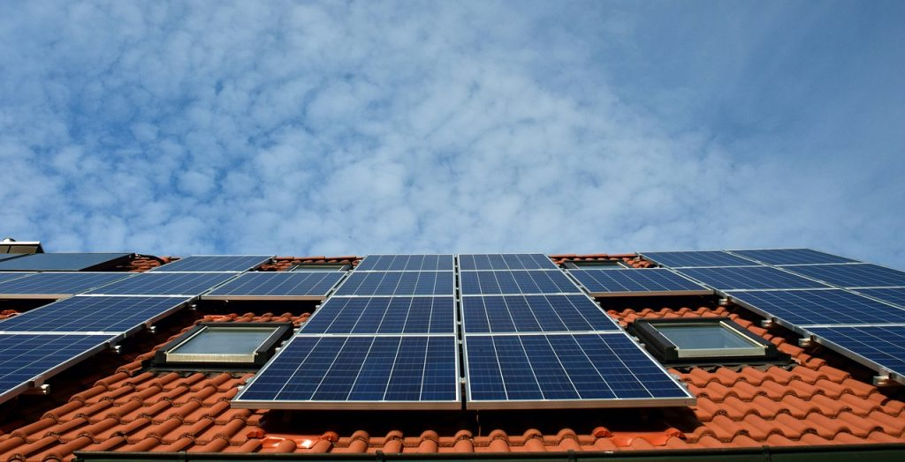
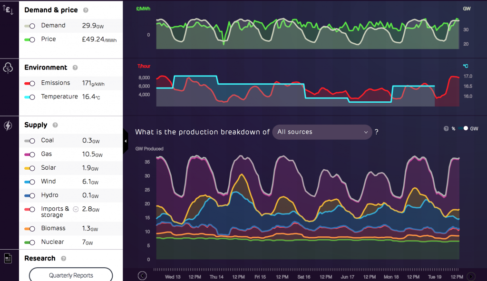
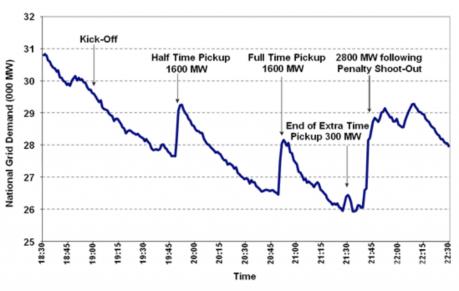
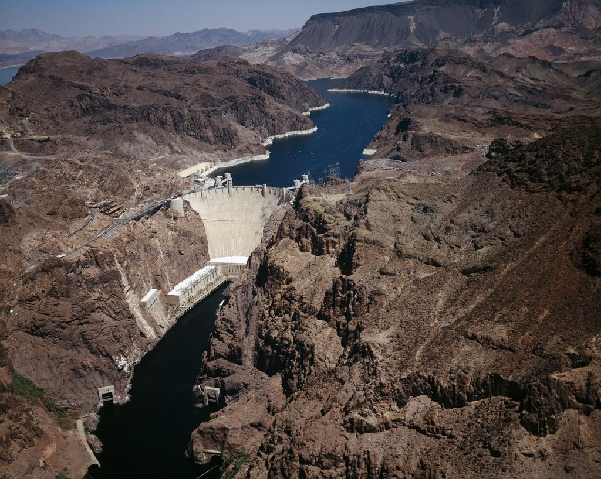
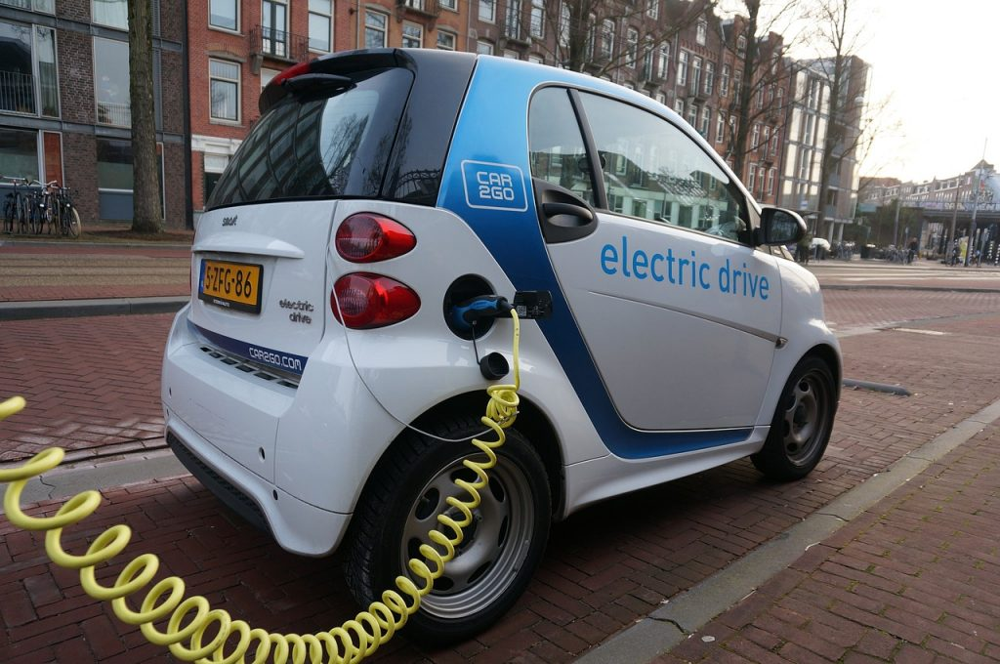
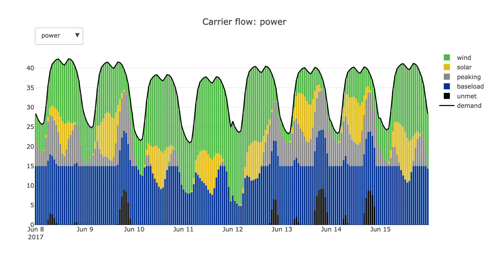

## *Why renewables are difficult*

*Originally published 2018, updated 2021*

---

*Renewable energy represents a promising solution to climate change since it emits no greenhouse gases. However, it poses some difficulties for power systems. Source: U. Leone*

---

The public have been aware of the importance of reducing carbon emissions since around the 1980’s. Furthermore, renewable technologies such as solar and wind have been around for decades. Under these conditions, it’s surprising that most countries still generate the majority of their electricity from carbon-emitting fossil fuels. Why, after decades of both the problem and a possible solution being known, haven’t renewables taken off yet? This article describes why renewables are “difficult”, and how the world can keep the lights on into the future in a cheap, secure, and sustainable way.

Until recently, the primary reason was economics. It was impossible to build wind turbines and solar panels cheaply enough to compete with fossil fuel technologies, which have become highly cost effective after more than 100 years of use. Governments were not willing to spend billions to subsidise renewables when electricity could be generated cheaply by other means. Recently, however, improved manufacturing methods, economies of scale and increased competition [sent prices plummeting](https://ourworldindata.org/cheap-renewables-growth). The price of solar panels has decreased by a factor of 200 in the last 45 years, and wind farms (even offshore) are now [cost-effective without subsidy](https://www.nature.com/articles/s41560-020-0661-2).

So, is it just a matter of time before fossil fuel electricity disappears? Why are societies still so hesitant to go 100% renewable? To understand why, one needs a quick introduction to power systems: the industries, infrastructures and markets based around electricity.

At their core, power systems are supply & demand problems. Industries and consumers use electricity provided by generators. One key feature distinguishes power systems from other economic markets: there is very limited means of storing it at large scale (with the notable exception of hydropower, discussed below). For this reason, supply must match demand on a second-by-second basis.

---

*A still from Drax Electric Insights, where electricity demand and generation levels can be browsed through, both in real time and historically. Source: Drax Electric Insights*

---

(As an aside, in the UK, there is a fantastic website, called [Drax Electric Insights](electricinsights.co.uk/#/homepage?_k=s45kdk), in which UK electricity demand, and from which sources it is generated, can be browsed through in real time as well as historically. Looking through it for a few minutes will give a better feel for how power systems work than any blog post can).

Before renewables, most electricity came from fossil fuel plants. Fuel (mostly coal or gas) was burnt at different rates and level of electricity supply was directly adjusted to meet demand. This isn’t always easy; for example, the UK’s system operator had to deal with a [massive demand spike](https://twitter.com/Grid_Media/status/997484517479911424) just after the royal wedding, as millions turned on their kettles at the same time.

---

*A famous graph showing total UK electricity demand during the 1990 World Cup semi-final against Germany, with spikes at times that viewers turned on their kettles en masse. System operators had to rapidly adjust supply to ensure the lights stayed on. Source: National Grid*

---

With renewables, the single biggest difficulty is that their production levels can’t be controlled. It’s not always windy or sunny, and times of high renewable output do not always align with times of high demand. How does one ensure the lights stay on on a cloudy day or when the wind tails off?

In most countries, this is not yet a problem since renewable capacity is still small and there’s ample conventional backup capacity. Renewables produce whatever electricity they can, and the rest is picked up by the conventional plants.

A problem occurs when countries start generating most of their electricity from renewables as this drastically changes the economic outlook of power markets. In a nutshell, building renewable capacity displaces fossil fuel generation, but not generation capacity; all power plants must be kept open for the rare days when there isn’t any wind or sun. Keeping these plants open but using them infrequently is very expensive, and closing them is impossible, unless you want to accept significant risks of blackouts on calm, cloudy days. It’s a perilous choice: higher electricity prices or reduced security of supply, and this problem defines the difficulties of renewable electricity systems.

Thankfully, there are a few ways that society can generate most of their electricity from renewables while keeping prices low and supply secure. They fall broadly into two categories.

The first is electricity storage. With grid-scale storage, excess electricity production on windy or sunny days can be stored and used in times when renewable output is low. Besides adding to supply security, this would enhance the economic picture since storage owners buy up electricity when price is low and sell it when price is high, evening out price jumps and allowing a smaller number of conventional plants to run more often. Almost all grid-scale storage currently in existence is [hydropower](https://en.wikipedia.org/wiki/Hydropower), which countries like Norway use to generate almost all their electricity but requires a mountainous terrain and access to water. The reason other grid-scale storage is rare is economics. Most storage technology (e.g. battery) prices still have to drop significantly before they can be used at large scale.

---

*Hydropower provides an economical option to store electricity, but requires mountainous terrain. Source: skeeze*

---
 
A second solution is interconnecting different countries and allowing them to share electricity. When it is wind-free in London, it usually is in Scotland as well; but it may be windy in Germany or Spain. Transporting electricity around could help alleviate supply insecurity. Many countries are doing just this; the UK, for example, currently has interconnections with France, the Netherlands, Belgium and Ireland, and more are in the pipeline. They may eventually from part of the [*European Supergrid*](www.opusenergyblog.com/everything-you-need-to-know-about-the-european-super-grid/), where electricity can be transported across Europe to balance out regional renewable supply peaks and troughs.

The prospect of combining hydropower and interconnections between countries is tempting, since it means countries with lots of wind but little storage capacity, like Germany or Denmark, could “[use Norway as a battery](https://www.greentechmedia.com/articles/read/experts-respond-to-norway-battery-pack-dismissal#gs.vpr=MXc)” by exporting their excess wind power to Norway in windy periods, which allows dams to accumulate water. In calm spells, hydropower generation levels are increased and excess electricity exported back the other way. Making this work will require significant increases in Norwegian hydropower infrastructure, interconnection lines and international cooperation.

---

*The batteries in electric cars can be used for grid management provided that owners agree to this. Source: Marilyn Murphy*

---

Another creative solution to the storage problem is to [use the batteries in electric cars](https://www.technologyreview.com/s/518066/could-electric-cars-threaten-the-grid/). Electric car uptake will lead to demand spikes when people return from work and plug them in. An electric car owner can get the option of cheaper electricity if it means her car’s battery is not charged (smart charging), or even emptied (known as vehicle-to-grid), during demand spikes and recharged when demand is lower. Such approaches are [currently being trialled in the UK](https://www.youtube.com/watch?v=kl9_cWF7fXo).

Current power systems are not yet ready to use renewables for the majority of their electricity supply. However, the immediacy of the climate change danger means business-as-usual is not an option, and a total energy revolution is required. Presently, the most realistic solution is the use of renewables (see a separate blog post on nuclear power here). Nobody knows exactly how the power system of the future will look. But everyone agrees it will be very different.

---

*A still from an online tutorial on power system models, showing generation from different sources.*

---

#### Want to know more?
 
For a similar discussion on the merits of nuclear power, see [this blog post](whats_the_deal_with_nuclear.md). To get a feel for how a power system works, see [this page](https://github.com/ahilbers/renewable_test_PSMs). It allows users, without any downloads or installs, to create a model of the UK power system, and see how electricity is generated from renewable and conventional sources.

---
